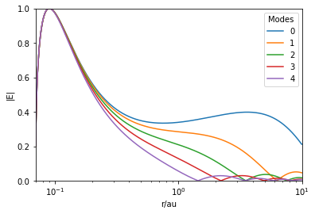

# Eccentric Astrophysical Discs

This is a repository for the code I created as part of my [Cambridge Maths Part III](https://en.wikipedia.org/wiki/Part_III_of_the_Mathematical_Tripos) essay (as part of the 2018-19 academic year). It has the code, as well as a notebook file for example use.

# Background

This essay was done on an academic basis, and assumes a lot of background knowledge of the subject.

To look at it simply: the eccentricity of an astrophysical disc can be expressed through a function E(r,t) which varies with distance from the central object (r) and time (t). In the essay, I derived a linear partial differential equation for the time-evolution of this function. I then solved this equation by discretizing and solving the corresponding eigenvalue problem. Finally, I selected the eigenvectors and eigenvalues which corresponded to a physical solution, and plotted them (see example below).

# References

References are assigned in the paper. In particular, Gordon Ogilvie should be cited as the Essay Setter in this case.

The code makes use of the [numpy](https://numpy.org/), [matplotlib](https://matplotlib.org/) and [scipy](https://scipy.org/) python libraries.